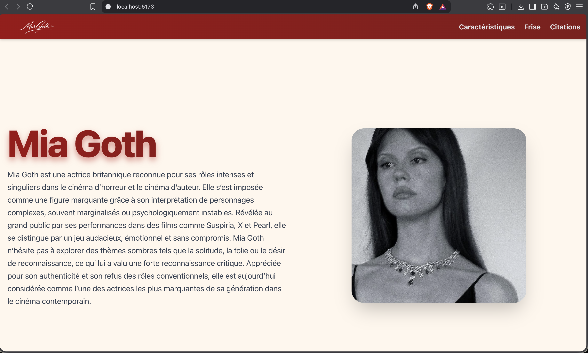

# Adapage React

A modern and high-performance web project built with **React 19** and **Vite**, using **TypeScript** for robustness and **TailwindCSS 4** for an elegant, responsive style.

## Description

This project is a showcase web application highlighting several key sections:

- **Home**: Main presentation.
- **Features**: Highlighting Mia Goth's strengths.
- **Timeline**: Visualization of a journey and evolution.
- **Testimonials**: Feedback and experiences from Mia Goth.

## Features

- **Performance**: Instant startup and fast HMR thanks to Vite.
- **Modern Design**: Polished user interface with TailwindCSS 4.
- **Responsive**: Adapted to all screen sizes (mobile, tablet, desktop).
- **Navigation**: Smooth routing managed by React Router Dom 7.
- **Strong Typing**: Maintainable and secure codebase with TypeScript.

## Technologies

This project uses the latest web development technologies:

- [React 19](https://react.dev/)
- [Vite](https://vitejs.dev/)
- [TypeScript](https://www.typescriptlang.org/)
- [TailwindCSS 4](https://tailwindcss.com/)
- [React Router Dom 7](https://reactrouter.com/)